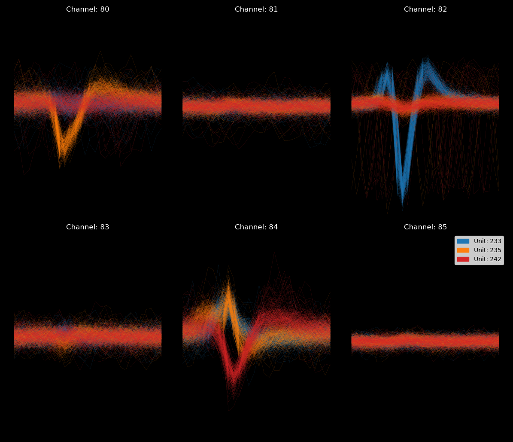
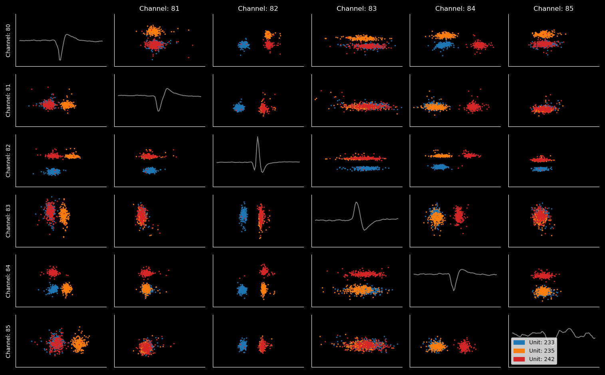

# post-kilosort (PKS)
Python-based toolkit to import and analyze Neuropixels probes data that was previously processed using Kilosort 3.0. It is an alternative to Phy. In contrast to Phy it does not have a convenient GUI, instead it is  purely Matplotlib and command-line based. It is however light-weight and highly customizable.

Tutorial coming soon!

To start, run:

```shell
$ python -i pks.py path/to/folder_with_data
```

This should load a few example figures. (Feel free to customize the file "pks.py")


## Loading data
Appart from running the file pks.py, you can load a data-set into your own Python code as follows:

```python
from pks_processing import pks_dataset
path = 'path/to/folder_with_data'
data = pks_dataset(path) # Loads the dataset.

# Having a look at the dataset
data.clusters # A dataframe with all clusters as identified by Kilosort
data.sort.todo() # The next 10 units that PKS thinks you should be working on
```
Note that "path" contains the path to the folder with your data-set, not any particular file in that data-set.

### How data is saved in PKS
After you run PKS for the first time, a file **"changeSet.py"** will be created in the folder "pks_data". This file is will contain all manipulations you make on the dataset **no datafiles are changed by PKS.** You can remove lines from changeSet.py if you later decide not do any particular manipulation. You can also add lines if there is something you want to do every time you load the data. For instance, plot a certain figure (see below).

If you do not want to save your manipulations toggle the save option as follows:
```python
data.save_data = False # By default it is set to True
```

## Plotting

To plot waveforms, amplitudes (in time) or first principal component:

```Python
units = [0, 1, 2, 10] # Will plot unit 0, 1, 2 and 10
channels = [0, 1, 2, 3, 4, 5] # Will plot the first 6 channels
waveform_plot = data.plot.waveform(units, channels) # Waveform plot

# NOTE: if you don't specify units or channels, they will be inferred from the oldest open plot:
amplitude_plot = data.plot.amplitude()  # Amplitude-in-time plot
pca_plot = data.plot.pca() # First principal component plot
```

An example of a waveform plot:


And a PCA (scatter) plot:



You can plot any attribute in time (such as in the default amplitude plot) or as a scatter (such as in the default PCA plot). To do this, use the function plot.custom_plot. (Tutorial to follow).

You can add and remove units to each plot individually or to all plots simultaneously

```Python
waveform_plot.add_unit(22) # Will add unit 22 to the waveform plot
data.plot.add_unit(22) # Will add unit 22 to ALL OPEN PLOTS

waveform_plot.remove_unit(10) # Will remove unit 10 from the waveform plot
data.plot.remove_unit(10) # Will remove unit 10 from ALL OPEN PLOTS
```

You can also change the channels that are being displayed.

```python
waveform_plot.change_channel(0, 10) # Will change the channel on the first axes of the waveform plot to channel 10
data.plot.change_channel(0, 10) # Will change the channel on the first axes for every plot.
```

Finally there are two plots that do not look at the waveform, but only at spike timing. Use these two to get an idea for unit quality.

```python
# Correlogram
data.plot.correlogram() # Will plot the correlogram from all units in the oldest open figure
data.plot.correlogram([1, 2]) # Will plot the correlogram of unit 1 and 2

# Inter-spike-interval
data.plot.ISI(2) # Will plot the ISI of unit 2 (a unit must be specified)
```


## Sorting Workflow

1. Make the plots you want. I like waveform, amplitude-in-time and the PCA plot, but there are a lot of possibilities.
2. Have look at the cells PKS think you should sort (data.sort.todo()). Have close look at 'spikeCount', 'Amplitude' to see if it is worth your time to clean the unit.
3. Use add_unit, remove_unit and change_channel to get a sense for the units you are looking at. (PKS currently does not use "template-similarity", however, you can look at the similarity matrix in self.similarity_matrix and get any template using the method data.get_template(unit).)
4. Use the sort methods to manipulate the data-set. **NOTE: these manipulations are automatically saved (see above)**

```python
data.sort.translate(15, -1) # Will translate unit 15 one datapoint in time.
data.sort.merge_units(14, 15) # Will merge the spikes of unit 14 into unit 15
data.sort.split_unit(14, [11, 12, 13], 2) # Will split unit 14 into 2 clusters by doing k-means clustering on channels 11, 12 & 13.
data.sort.delete_unit(17) # Will delete unit 17
data.sort.mark_done(15) # To mark unit 15 as "done"
```
Plots are automatically updated following sorting manipulations. There should not be a need ever to remove your hands from the keyboard or use a mouse.


5. Have a look at data.sort.todo() to see which units PKS thinks you should be working on next.

Hint: If you find yourself repeating similar methods over and over, just bind them to something convenient in your workspace:
```python
todo = data.sort.todo # Note binding the function itself, not its output
todo() # Will now print the todo list.

cut = data.sort.delete_unit # Again, binding the function itself, not its output
cut(22) # Will now delete unit 22 from the data.
```

# Working with TTL channels
Timestamps from pulses collected on separately collected analog input channels can be obtained as follows:
```python
stamps = data.get_nidq() # Outputs a Pandas dataframe with all your timestamps.
```

You can make peri-event histograms using the function 'peri_event' for instance. Suppose you collected the onset of some CS on analog input 1:
```python
CS_onset = stamps[stapms.Channel=='AI_1']
peh = data.plot.peri_event(14, CS_onset, peri_event_window = (-2, 7)) # Will plot the PEH for unit 14 from -2s to 7s around CS+ onset.
```
NOTE: you can add or remove cells to the PEH plot in the same way as you'd add and remove cells to any plot (see above).

# Opto-tagging
There is a separate sub-library to verify if neurons are opto-tagged. To use it, first extract your light pulses from the AI channels (see above) then insert them into the opto-tagging object as follows:
```python
light_pulses = stamps[stamps.channel = 'AI_2'] # Suppose your light pulses were collected on AI_2, it could be any channel or some external source of course.
window = (0, 5) # This is the window (in ms) where we expect the light response
data.opto_tagging.set_parameters(light_pulses, window)
```

Now you should be able to inspect potentially opto-tagged neurons by just adding them to your plots.
```python
data.opto_tagging.add_tagged_spikes(14) # Will add the evoked action potentials of unit 14 as a custom unit to all open plots.
```
For antidromic tagging there is also a method that will perform the collision test. See the function documentation for help.

# Future plans

1. PKS currently works on the file "temp_wh.mat" which is the whitened signal constructed by Kilosort. Soon you will also be able to load raw unfiltered (both spikeGLX and OpenEphys).

2. To include a method to remove light artifacts, which are prevalent in opto-tagging experiments.

